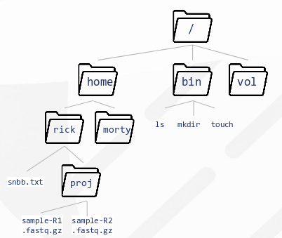
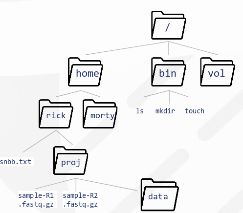

# Introdução ao UNIX para Bioinformática - Where the is a shell there is a way

## Definição

A definição formal do termo "UNIX" pode ser encontrada no artigo científico original (1978), escrito por Dennis Ritchie e Ken Thompson.

> UNIX is a general-purpose, multi-user, interactive operating system for the larger
> Digital Equipment Corporation PDP-11 and the Interdata 8132 computers. It offers a
> number of features seldom found even in larger operating systems, including
> 1. A hierarchical file system incorporating demountable volumes,
> 2. Compatible file, device, and inter-process I/O,
> 3. The ability to initiate asynchronous processes,
> 4. System command language selectable on a per-user basis,
> 5. Over 100 subsystems including a dozen languages,
> 6. High degree of portability

Podemos extrair do inglês original que o UNIX é um sistema operacional interativo, multiusuário e de propósito geral. Além dessa definição, é importante notar as características destacadas pelos desenvolvedores: um sistema de arquivos hierárquico incorporado a volumes "montaveis"; capacidade de trabalhar com processos assíncronos; e alta portabilidade. Essas mesmas características foram responsáveis pela popularização do sistema, fazendo com que o UNIX fosse adotado em diversos computadores da época além de inspirar faculdades e laboratórios a desenvolverem sua propria versão do sistema operacional.

O UNIX foi criado em cima de filofias propostas originalmente por Ken Thompson. O objetivo era que o sistema operacional fosse desenvolvido de forma clara, modular e com o código extensivo, de forma que esse código se tornasse fácil de se manter e de se reproduzir não apenas pelos seus criadores, mas também por outros desenvolvedores.

## UNIX e Bioinformática

Softwares e algoritmos de bioinformática necessitam de uma performance computacional alta. As máquinas usadas para executar tais tarefas geralmente contam com processadores de alta velocidade, uma grande quantidade de memória RAM e suporte para armazenamento de
uma grande massa de dados. Tais máquinas são comumente chamada de servidores. Devido a sua capacidade de operar computações de alta performance (HPC), o UNIX é o sistema operacional usado na grande maioria dos servidores - além de outros sistemas operacionais que foram desenvolvidos baseados no UNIX como  *SunOS/Solaris*, *IBM AIX*, *Hewlett-Packard HP-UX*, Linux e etc. Dessa maneira, a familiaridade com o UNIX é indispensável para quem deseja trabalhar com bioinformática.

Dos componentes do UNIX, três têm sua importância destacada para tabalhos de bioinformática: o sistema de arquivos, o **interpretador de comandos** e o gerenciador de processos. O sistema de arquivos é responsável por toda hierarquia de arquivos e diretórios do sistema; O gerenciador de processos é essencial para administração, fornecendo insights sobre o que está acontecendo internamente no sistema; E por último, mas não menos importante, o interpretador de comandos: a principal interface fornecida ao usuário para manuseio do sistema operacional, e foco do nosso curso.

A ideia é introduzir comandos utilizados no dia a dia do bioinformata, fornecendo o conhecimento necessário para utilizar a linha de comando e executar softwares de bioinformática voltados para análise de dados de sequenciamento de segunda geração (NGS) para DNA humano.

## O promtp de comando

Ao acessar o interpretador de comandos (também conhecido como *shell*) pela primeira vez  somos introduzidos ao **prompt de comando**: uma mensagem de texto curta no início da linha de comando em uma interface de linha de comando. A mensagem de texto tem como objetivo informar ao usuário propriedades do ambiente em que ele acabou de acessar.

No exmplo acima três componentes do texto são destacados: **wbg**, **gnmk-analise-01** e **~**. O "wbg" é referente ao nome do usuário que está usando o ambiente; o "gnmk-analise-01" é, de forma simplificada, o nome do computador dentro da rede que o mesmo se encontra - um termo mais técnico para essa descrição é *hostname*; o "~" é o caminho relativo do diretório atual, ou seja, a descrição "reduzida" do diretório onde você se encontra.

## Caminhos relativos e absolutos

Assim como no Windows, diretórios são usados para agrupar arquivos em uma estrutura hierárquica. O "caminho" (do inglês, *path*) de um diretório guarda a informação da localização daquele diretório no sistema. Usamos o comando `pwd` (***p**resent **w**orking **d**irectory*) para pedir ao terminal que nos informe o caminho absoluto do diretório onde estamos. A estrutura de diretórios do UNIX segue o padrão de uma árvore, onde o diretório raiz é o **/**.

No exemplo acima, caso o diretório de trabalho seja `proj`, ao utilizarmos o comando `pwd` o resultado seria `/home/rick/proj`.

Para caminhos muito longos, é comum utilizar caminhos relativos. O `.` repesenta o diretório atual (`.` = `pwd`); o `..` representa o diretório "pai" do diretório atual - no exemplo acima, o diretório `..` representaria `/home/proj`; o `~` representa o *home* do usuário, ou seja, para o usuário *rick* `~` seria `/home/rick` e para o usuário *morty* `~` seria `/home/morty`.

## Diretórios e Navegação

A interface gráfica que estamos acostumados usando sistemas operacionais modernos não é acessível pelo terminal, dessa maneira precisamos de comandos para executar até mesmo as tarefas mais trivias como mudar de diretório, criar novos arquivos e etc. Para mudar o diretório que estamos trabalhando usamos o comando `cd` (***c**hange **d**irectory*). A sintaxe é a seguinte:

`$ cd <caminho-do-diretorio>`

O `cd` consegue interpretar tanto caminhos absolutos como caminhos relativos. Usando a árvore de diretórios acima, trabalhando do diretório `proj` podemos ir ao diretório `rick` usando tanto `$ cd /home/` quanto `cd ..`, note que como `.` = `pwd` o comando `$ cd .` nos deixaria no mesmo lugar.

Para criar um diretório novo usamos o comando `mkdir` (***m** a **k**e **dir**ectory*).

`$ mkdir <caminho-do-novo-diretorio>`

Dessa maneira, para criar o diretório `data` dentro do diretório `proj` - trabalhando do diretório `proj` - usamos `$ mkdir proj`. O `mkdir`, assim como o `cd`, consegue interpretar caminhos relativo e absolutos.

Para verificarmos se o nosso novo diretório (`data`) foi realmente criado, devemos checar o conteúdo dentro do diretório `proj`. Para listar o conteúdo de um diretório usamos o comando `ls` (***l** i **s** t*).

`$ ls <caminho-do-diretorio>`

Como resultado, veríamos os arquivos `sample-R1.fastq.gz`, `sample-R2.fastq.gz` e o novo diretório `data` (alguns terminais usam cores no texto para diferenciar arquivos e diretórios).

Outra tarefa comum no cotidiano de quem trabalha com computadores é mudar arquivos de um diretório para o outro. No terminal conseguimos executar essa tarefa com comando `mv` (***m** o **v**e*). Para mudar o local de um arquivo com o `mv` utilizamos o comando da seguinte forma:

`$ mv <caminho(s)-do(s)-arquivo(s)> <caminho-do-novo-diretório>`

Seguindo nosso exemplo, para mover os arquivos `sample-R1.fastq.gz` e `sample-R2.fastq.gz` para dentro do diretório `data` usaríamos o comando `$ mv sample-R1.fastq.gz data` e `$ mv sample-R2.fastq.gz data` ou simplesmente `$ mv sample-R1.fastq.gz sample-R2.fastq.gz data`.

Como exemplo, caso quiséssemos mudar o nome do diretório `data` para `fastqs` - trabalhando do diretório `proj` - usaríamos o comando `$ mv data fastqs`.

## Cópias e deleções

Outros trabalhos triviais e comuns no dia a dia de quem trabalha em ambientes UNIX é fazer cópias e deleções, tanto de arquivos como de diretórios. Para nos auxiliar nessas tarefas utilizamos os comandos `cp` (***c**o **p** y*) e `rm` (***r**e **m** ove*), respectivamente. Para usar esses comandos em arquivos usamos a seguinte sintaxe:

`$ cp <caminho-do-arquivo> <caminho/nome-da-copia>`

`$ rm <caminho-do-arquivo>`

Existe uma particularidade quanto ao segundo argumento do comando `cp`. Caso esse argumento seja o caminho de um diretório, uma cópia do arquivo (com o mesmo nome) no diretório informado. Contudo, podemos especificar um novo nome para a cópia do arquivo nesse mesmo argumento. Por exemplo, o comando `$ cp meu-arquivo.txt /media/data` criará uma cópia do arquivo `meu-arquivo.txt` no diretório `/media/data`, e o comando `$ cp meu-arquivo.txt /media/data/meu-arquivo-copia.txt` criará uma cópia do arquivo `meu-arquivo.txt` chamada `meu-arquivo-copia.txt` no diretório `/media/data`.

Para fazer cópias e deleções de diretórios completos usaremos os mesmos comandos `cp` e `rm`, porém para trabalhar com diretórios teremos que usar a opção de linha de comando (*flag*) `-r`. O `-r` diz, tanto para o `cp` quanto para o `rm` que o comando deverá ser usado de forma recursiva. [Clarificando](https://panda.ime.usp.br/pensepy/static/pensepy/12-Recursao/recursionsimple-ptbr.html):

> Recursão é um método de resolução de problemas que envolve quebrar um problema em subproblemas menores e menores até chegar a um problema pequeno o suficiente para que ele possa ser resolvido trivialmente. Normalmente recursão envolve uma função que chama a si mesma.

Ou seja, com a flag `-r` os comandos serão executados em todos os arquivos e subdiretórios dentro de um dado diretório. Por exemplo, para copiar o diretório `meu-diretorio` para o diretório `/media/data` usaríamos o comando `$ cp -r meu-diretorio /media/data`. A particularidade do segundo argumento do `cp` citada anteriormente também é válida nesse caso. De modo semelhante, para excluir o diretório que criamos (`/media/data/meu-diretorio`) usamos o comando `$ rm -r /media/data/meu-diretorio`.

## Trabalhando com arquivos de texto

Durante boa parte do seu trabalho, o bioinformata estará trabalhando com arquivos de texto. Formatos como .fastq, .sam e .vcf são todos arquivos de textos com uma formatação específica. Existem diversas formas de trabalhar com texto através do terminal, tarefas mais complexas exigem softwares e utilitários de linha de comando mais sofisticados como o [`awk`](https://www.gnu.org/software/gawk/manual/gawk.html) e [`sed`](https://www.gnu.org/software/sed/manual/sed.html), contudo como nosso material é de um cunho mais introdutório, não iremos abordar tais materiais.

Para exibir as primeiras linhas de um arquivo de texto no terminal, usamos o comando `head`. Por padrão, o `head` exibe as dez primeiras linhas de um arquivo, mas podemos especificar a quantidade de linhas que queremos ver no comando.

`$ head <arquivo-de-texto>`

Por exemplo, para exibir as primeiras dez linhas do arquivo `sample-R1.fastq` usamos o comando `$ head sample-R1.fastq`, para ver as primeiras doze linhas usaríamos `$ head -12 sample-R1.fastq`.

De forma análoga ao `head`, para exibir o conteúdo final de um arquivo de texto usamos o comando `tail`. O funcionamento é bastante similar ao comando anterior: por padrão, o `tail` exibirá as dez ultimas linhas de um arquivo de texto, mas esse número também pode ser especificado.

`$ tail <arquivo-de-texto>`

Por exemplo, para exibir as dez ultimas linhas do arquivo `sample-R1.fastq` usamos o comando `$ tail sample-R1.fastq`, para ver as doze ultimas linhas usaríamos `$ tail -12 sample-R1.fastq`.

Muitas vezes, estaremos trabalhando com arquivos de texto pequenos, onde não seria necessário ver apenas o início ou final do arquivo. Para esses casos, usamos o comando `cat`.

`$ cat <arquivo-de-texto>`

Por exemplo, o comando `cat sample-R1.fastq` exibirá todo o conteúdo de `sample-R1.fastq` no terminal. É comum que o conteúdo seja maior do que o espaço disponível para texto no terminal, nesses casos o conteúdo do arquivo que não está exibido pode ser acessado através da barra de rolagem.

Por ultimo, mas não menos importante, vamos introduzir o comando `grep`. O `grep` é um comando com uma função simples: ele procura por trechos de texto dentro de arquivos e nos retorna a linha em que o texto procurado ocorreu.

`$ grep <texto> <arquivo-de-texto>`

Por exemplo, para procurar em qual read do arquivo `sample-R1.fastq` está o comentário "SNNB" usamos o comando `$ grep SNBB sample-R1.fastq`. O resultado seria o seguinte:

`+M00538:55:000000000-A94Y6:1:2114:9628:27777 1:N:0:8 SNNB exemplo grep`

## Conclusão

Essa introdução será suficiente para dar continuidade ao curso, e usar na linha de comandos os softwares para realizar tarefas de bioinformática como `fastqc`. `bwa-mem`, `snpEff` e etc.
